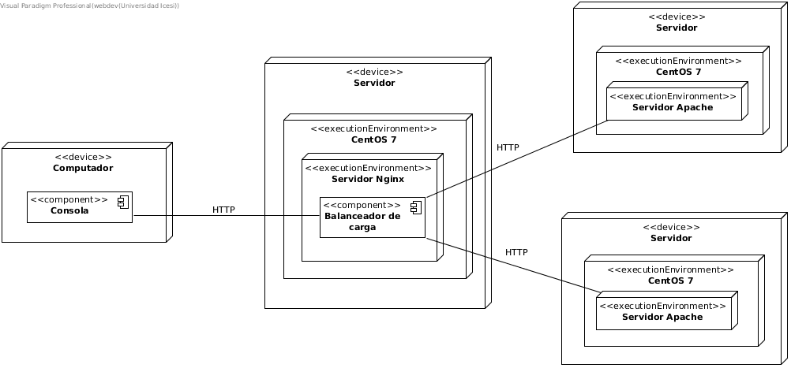
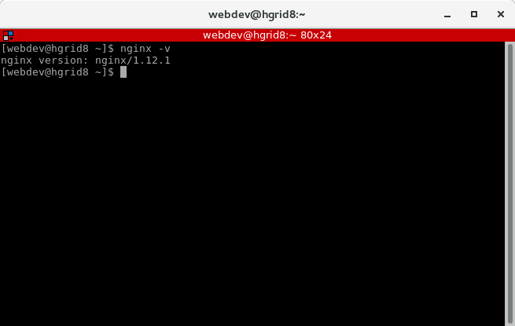
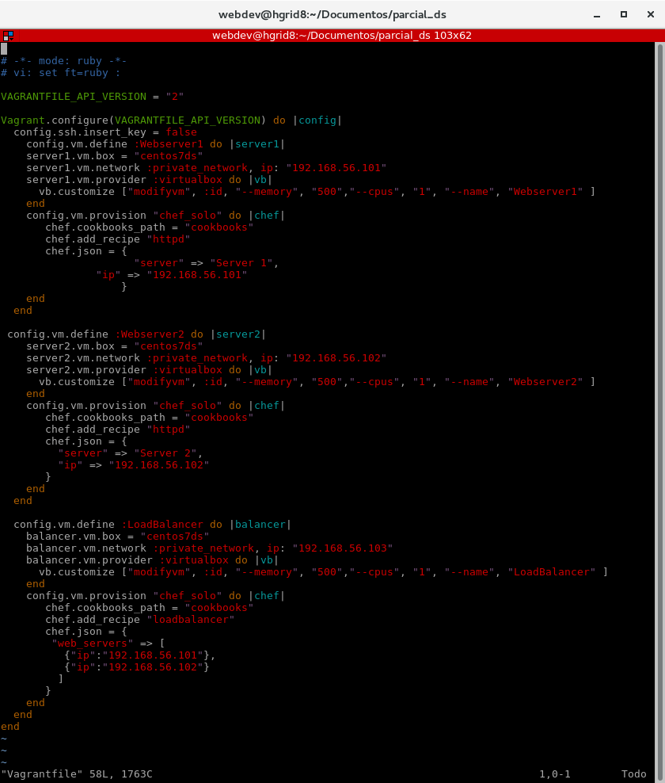
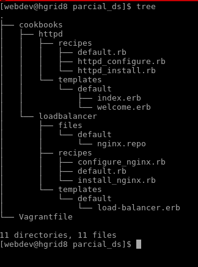
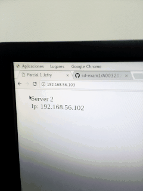

### Examen Parcial 1

**Universidad ICESI**  

**Curso:** Sistemas Distribuidos  

**Docente:** Daniel Barragán  

**Tema:** Automatización de infraestructura con Vagrant y Chef

**Estudiante:** Jefry Cardona Chilito

**Código:** A00320232

### Objetivos
* Realizar de forma autónoma el aprovisionamiento automático de infraestructura
* Diagnosticar y ejecutar de forma autónoma las acciones necesarias para lograr infraestructuras estables
* Realizar el aprovisionamiento automático de un balanceador de carga.

### Herramientas utilizadas
* Vagrant.
* Box del sistema operativo CentOS 7.
* Nginx.

### Descripción
En el desarrollo de la solución del parcial del balanceador se utilizó un servidor configurado con Nginx para realizar
el balanceo de carga y dos servidores web apache. El diagrama de deployment se muestra a continuación.



### Procedimiento

**1)** El parcial se desarrolló en los computadores de la sala Liason, los cuales ya tenian instalado Nginx. Por tal motivo
su instalación se omitió.



**2) Configuración del vagrantfile:**

Cuando se verificó que Nginex estuviera instalado en el equipo, se procedió a la configuración del Vagrantfile con las máquinas virtuales que se utilizarán posteriormente para realizar las tareas del balanceo de carga.



**3) Creación de cookbooks:**

A continuación se muestra la estructura de la implementación de los cookbooks que nos servirán para el aprovisionamiento de cada
una de las máquinas virtuales:



**4) Prueba de funcionamiento:**

Luego de tener el Vagrantfile y las recetas de configuración para las máquinas a usar, nos situamos en la carpeta que contiene el Vagrantfile y se escribe el comando ```vagrant up``` para levantar las máquinas y aprovisionarlas con cada una de las recetas. Cuando fue necesario tambien se utilizó el comando ```vagrant provision``` cuando se modificaba algunas de las recetas y no tener que volver a subir todas las máquinas de nuevo cuyo proceso puede llegar a ser bastante demorado.



**5) Problemas encontrados:**

Tuve un problema al momento de aprovisionar las máquinas ya que el computador no encontraba una ruta especificada en el archivo de configuración de nginx, parecía que no existía. Luego de varios intentos sin obtener un resultado favorable reinicié el computador y al intentar aprovisionar de nuevo, encontró la ruta. Entonces tal vez el error pudo haber estado en que dejó información en caché que estaba haciendo conflicto a la hora de montar las máquinas.

**6) Conclusiones:**
Dar solución a este parcial fue una gran experiencia ya que me permitió recordar unos conceptos que había obtenido en un curso
anterior pero que no había podido poner en práctica. Además, fué importante ya que me permitió observar los procesos que pueden llevar a cabo los servidores para ofrecer un servicio confiable, concurrente y escalable.
