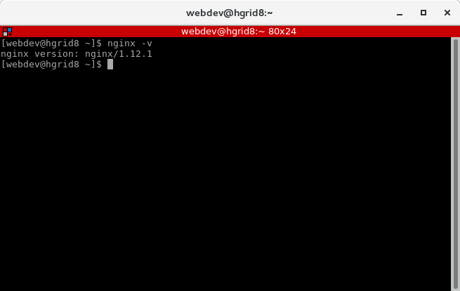

### Examen Parcial 1

**Universidad ICESI**  

**Curso:** Sistemas Distribuidos  

**Docente:** Daniel Barragán C.  

**Tema:** Automatización de infraestructura con Vagrant y Chef 

**Estudiante:** Jefry Cardona Chilito.

**Código:** A00320232

### Objetivos
* Realizar de forma autónoma el aprovisionamiento automático de infraestructura
* Diagnosticar y ejecutar de forma autónoma las acciones necesarias para lograr infraestructuras estables
* Realizar el aprovisionamiento automático de un balanceador de carga

### Herramientas utilizadas
* Vagrant
* Box del sistema operativo CentOS 7
* Nginx

### Descripción
En el desarrollo de la solución del parcial del balanceador se utilizó un servidor configurado con Nginx para realizar
el balanceo de carga y dos servidores web apache.

### Procedimiento

**1) El parcial se desarrolló en los computadores de la sala Liason, los cuales ya tenian instalado Nginx. Por tal motivo
su instalación se omitió.**

**2) Configuración del vagrantfile:**

Cuando se verificó que Nginex estuviera instalado en el equipo, se procedió a la configuración del Vagrantfile con las máquinas virtuales que se utilizarán posteriormente para realizar las tareas del balanceo de carga.

**3) Se crearon los cookbooks:**

A continuación se muestra la estructura de la implementación de los cookbooks que nos servirán para el aprovisionamiento de cada
una de las máquinas virtuales:

**4) Prueba de funcionamiento:**

**5) Problemas encontrados:**

**6) Conclusione:**
Dar solución a este parcial fue una gran experiencia ya que me permitió recordar unos conceptos que había obtenido en un curso
anterior pero que no había podido poner en práctica. Además, fué importante ya que me permitió observar los procesos que pueden llevar a cabo los servidores para ofrecer un servicio confiable 

